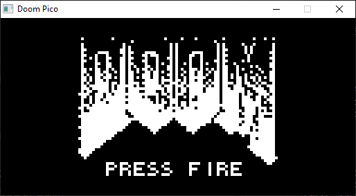
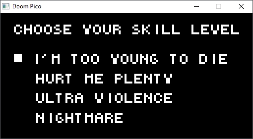
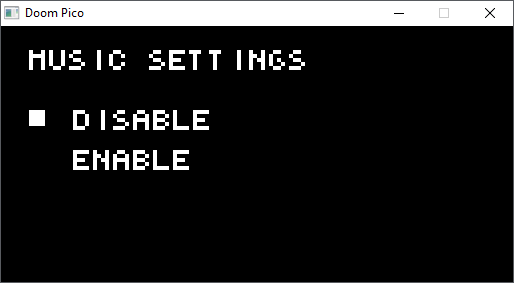
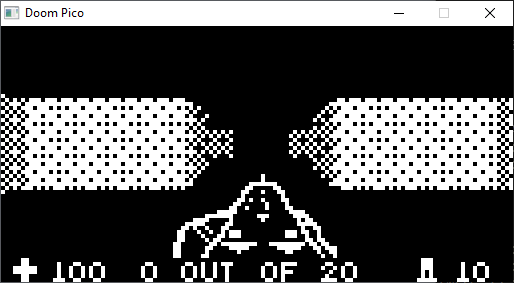

# doom-pico

A portable Doom-themed raycasting engine for microcontrollers.



## Description

**Doom Pico** is a port from *C++* to pure *C* of [Doom Nano](https://github.com/daveruiz/doom-nano) and [Doom Nano Brutality](https://github.com/Ritbulau/Doom-Nano-Brutailty), with the aim of easing the porting of the game to different microcontrollers and resource-contrained device.

### What has changed

- Complete refactoring of the game in C-style
- Platform independent
- General optimizations
- Reduce code size
- Removal of dead code
- Add Doxygen documentation
- Add Raylib implementation to play on PC

## Porting to other platforms

To make a port of **Doom Pico** for other platforms the user needs to define the *platform dependent* function implementations in [platform.c](src/platform.c):

```c
/**
 * @brief PLATFORM initialize user-defined functions.
 * 
 */
void platform_init(void)
{
    /* Add definition here */
}

/**
 * @brief PLATFORM start drawing a new frame.
 * 
 */
void platform_draw_start(void)
{
    /* Add definition here */
}

/**
 * @brief PLATFORM stop drawing current frame.
 * 
 */
void platform_draw_stop(void)
{
    /* Add definition here */
}

/**
 * @brief PLATFORM write pixel value to screen.
 * 
 * @param x     X coordinate
 * @param y     Y coordinate
 * @param color Pixel color
 */
void platform_draw_pixel(uint8_t x, uint8_t y, bool color)
{
    /* Add definition here */
}

/**
 * @brief PLATFORM play audio effect through speaker.
 * 
 */
void platform_audio_play(void)
{
    /* Add definition here */
}

/**
 * @brief PLATFORM read user controls and update button state.
 * 
 */
void platform_input_update(void)
{
    /* Add definition here */
}

/**
 * @brief PLATFORM get time in milliseconds from start of execution.
 * 
 * @return uint32_t Start time in milliseconds
 */
uint32_t platform_millis(void)
{
    /* Add definition here */
}

/**
 * @brief PLATFORM apply blocking delay in milliseconds.
 * 
 * @param ms Delay in milliseconds
 */
void platform_delay(uint32_t ms)
{
    /* Add definition here */
}
```

## Play the game with Raylib

If you just want to compile and play the game on your PC, a [Raylib](https://www.raylib.com/) implementation of all the [platform.c](src/platform.c) functions has been provided.

To play the Raylib implementation, just run the following commands:

```bash
./install_raylib.sh
make USE_RAYLIB=1
./doom_pico
```

...or just:

```bash
make run
```

**Disclamer:** Only Windows and Linux platforms are supported.

## Screenshots





